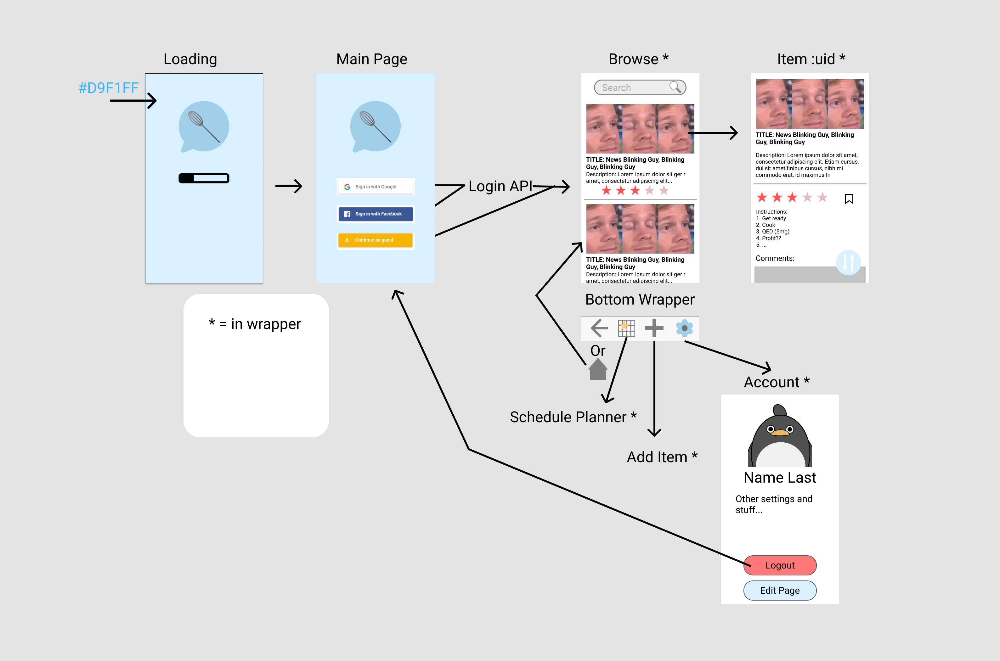

# Kitchen Dash

Kitchen Dash will help you share your recipes with the work and view user created content! Browse through a curated collection of user created recipes with instructions, ingredients, ratings

Kitchen Dash for HackED 2021, a 24 hour hackathon! 

## Plan

## Projects Base

* [AfaqNabi/react-native-firebase](https://github.com/AfaqNabi/react-native-firebase) - firebase login
* [Sooraj-beep/food-o-meter](https://github.com/Sooraj-beep/food-o-meter) - calorie tracker
* [Zeyu-Li/converter](https://github.com/Zeyu-Li/converter) - 1 page converter for wet and dry ingredients

## Team

* [@AfaqNabi](https://github.com/AfaqNabi)
* [@Sooraj-beep](https://github.com/Sooraj-beep)
* [@Xiaoyu-Ben-Wang](https://github.com/Xiaoyu-Ben-Wang)
* [@me](https://github.com/Zeyu-Li)

